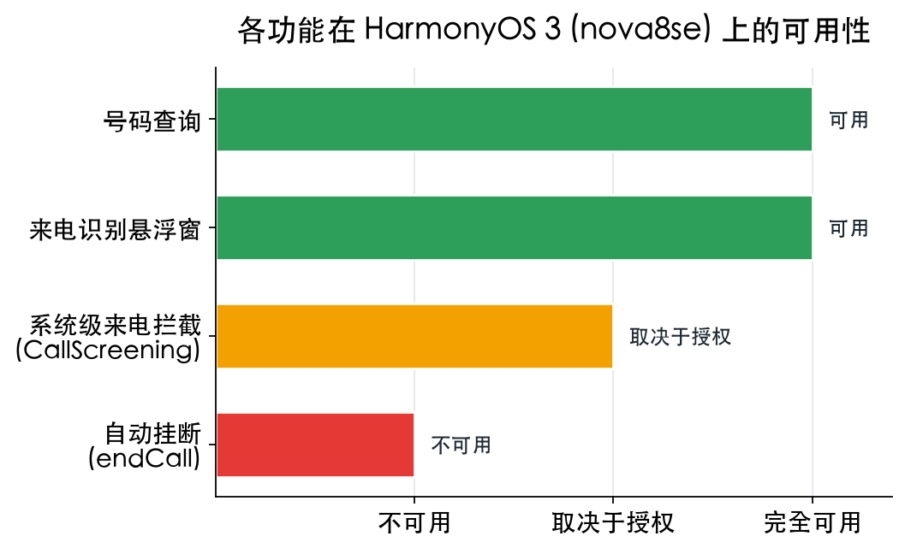
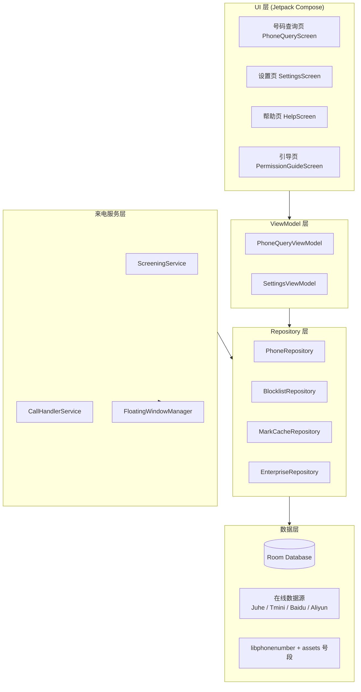
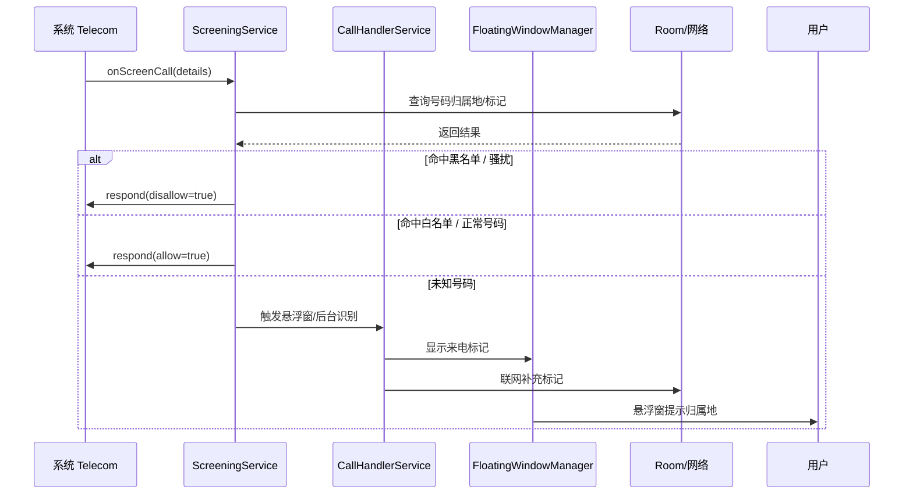
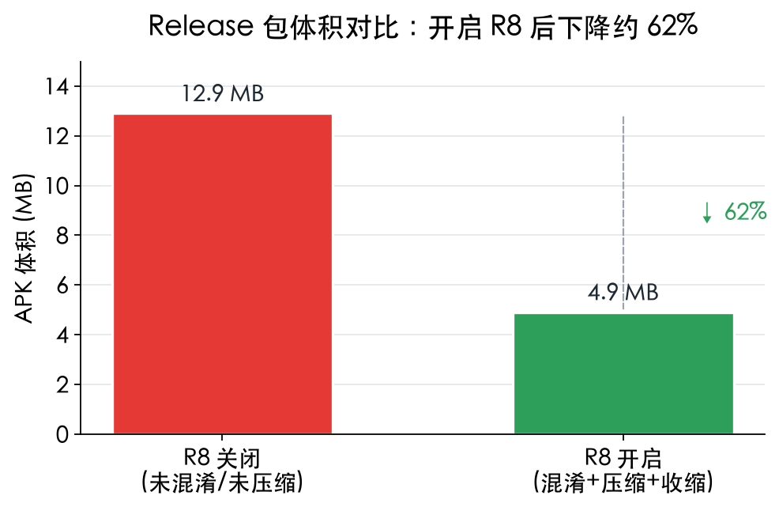

# 没骚扰 · Refuse Phone

<p align="center">
  
</p>

<p align="center">
  <a href="https://github.com/deep2code/refuse-phone/actions/workflows/build-release.yml">
    
  </a>
  
  
  
</p>

**没骚扰** 是一款 Android 来电识别与骚扰拦截应用：输入号码可查归属地、运营商、骚扰标记；来电时自动识别并在命中黑名单或骚扰规则时直接拦截。核心拦截基于系统 `CallScreeningService`，无需常驻前台，也无需替换系统拨号应用。

---

## 功能一览

| 模块 | 说明 |
| --- | --- |
| 📞 **号码查询** | 输入手机号或固话，离线返回归属地、运营商、区号、邮编、号段、骚扰标记等全部属性。 |
| 🛡️ **来电识别** | 来电时弹出悬浮窗，实时显示归属地与骚扰标记，一眼判断要不要接。 |
| 🚫 **骚扰拦截** | 命中本地黑名单或骚扰号码库时，由系统 `CallScreeningService` 直接拒接。 |
| ⚙️ **黑白名单** | 支持自定义黑名单、白名单，配合云端标记库形成多层拦截策略。 |
| 📵 **自动挂断** | Android 9+ 上若获得默认拨号角色，可在响铃前主动 `endCall`（部分 ROM 受限）。 |

---

## 技术栈

- **UI**：Jetpack Compose + Material 3
- **架构**：MVVM + Repository 模式
- **依赖注入**：Hilt
- **本地数据**：Room（黑名单、标记缓存、号段库）
- **来电处理**：`CallScreeningService` / `TelecomManager`
- **构建**：AGP 8.9.0 / Gradle 8.11.1 / JDK 21 / compileSdk 34 / minSdk 24

---

## 应用架构



---

## 一次来电的处理流程



---

## Release 包体积：开启 R8 前后对比

<p align="center">
  
</p>

开启 R8 后，Release APK 从 **12.9 MB** 下降至 **4.9 MB**，体积减少约 **62%**。项目在 `app/build.gradle.kts` 中默认启用 `isMinifyEnabled = true`。

---

## 本地构建

### 环境要求

- JDK 21（本机示例：`/opt/homebrew/opt/openjdk@21`）
- Android SDK + build-tools 35.0.1
- `JAVA_HOME` 必须显式设置，否则 macOS `/usr/bin/java` stub 会提示找不到 Java Runtime

### 调试包

```bash
export JAVA_HOME=/opt/homebrew/opt/openjdk@21
./gradlew assembleDebug
```

### 正式包

```bash
export JAVA_HOME=/opt/homebrew/opt/openjdk@21
./gradlew assembleRelease
```

> 正式包需要签名。本地签名配置与踩坑记录详见 [`docs/BUILD_LOCAL.md`](docs/BUILD_LOCAL.md)。

### 编译常见坑

1. `VectorDrawable` 仅支持 `<path>` / `<group>` / `<clip-path>`，不要直接使用 `<circle>` / `<line>` / `<rect>`。
2. 线帽属性名为 `android:strokeLineCap`（大写 C），小写会报 `attribute not found`。
3. 若代理环境触发 `lintVitalAnalyzeRelease` 的 PKIX 错误，项目已关闭 `checkReleaseBuilds = false`。

---

## 自动打包（CI / GitHub Actions）

推送 `main` 分支、打 `v*` 标签，或手动触发时，`.github/workflows/build-release.yml` 会自动构建 Release APK：

| 触发方式 | 产物 |
| --- | --- |
| 推送到 `main` | Actions → Artifacts 中可下载 APK |
| 打 `v*` 标签（如 `v1.0.0`） | 自动创建 GitHub Release 并附 APK |
| 手动触发 | 同上 |

签名需要配置以下仓库 Secrets：

- `SIGNING_KEY`：`release-key.jks` 的 base64 编码
- `KEYSTORE_PASSWORD`
- `KEY_ALIAS`
- `KEY_PASSWORD`

未配置时 CI 仍会产出未签名 APK，用于验证构建是否通过。

---

## HarmonyOS / 华为 ROM 兼容说明

华为/HarmonyOS 出于系统整合考虑，通常**不允许第三方应用设为默认拨号应用**。因此：

<p align="center">
  
</p>

- **号码查询**、**来电识别悬浮窗**完全可用。
- **系统级来电拦截**走 `ROLE_CALL_SCREENING`，可单独授权，通常不受默认拨号限制。
- **自动挂断**（主动 `endCall`）**不可用**，因为它必须持有默认拨号角色。

> 应用已在设置页与引导页给出对应提示：未持有默认拨号角色时，自动挂断开关下方会显示红字说明，并引导用户开启「系统级来电识别」。

---

## 项目目录

```text
refuse-phone/
├── app/                          # Android 应用模块
│   ├── src/main/java/.../        # Kotlin 源码（UI / ViewModel / Repository / Service）
│   ├── src/main/res/             # 资源文件
│   └── src/main/assets/          # 离线号段数据等
├── docs/
│   ├── assets/                   # README 图表
│   └── BUILD_LOCAL.md            # 本地构建与签名配置
├── scripts/
│   ├── generate_icon.py          # 启动图标生成脚本
│   └── generate_charts.py        # README 图表生成脚本
├── .github/workflows/            # GitHub Actions CI 工作流
├── README.md                     # 本文档
└── build.gradle.kts              # 项目级构建配置
```

---

## 开源许可

本项目采用 MIT 许可证，详见 LICENSE 文件。
